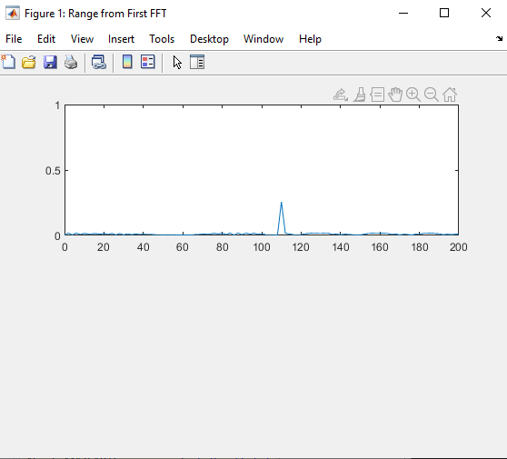
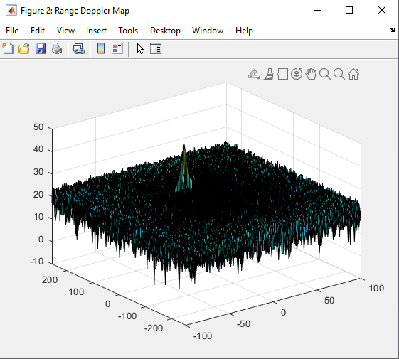
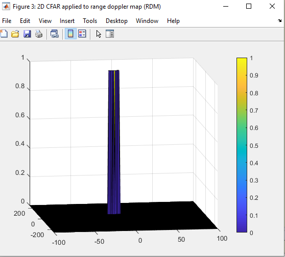

# SFND Radar Target Generation and Detection

## Scope
Configure the FMCW waveform based on system requirements as below.

Objectives of the project are:
- Define the range and velocity of target and simulate its displacement.
- For the same simulation loop process the transmit and receive signal to determine the beat signal
- Perform Range FFT on the received signal to determine the Range
- Towards the end, perform the CFAR processing on the output of 2nd FFT to display the target.

This project is implemented with Matlab.

### Rubric Points

#### 1. FMCW Waveform Design
Using the given system requirements, design a FMCW waveform. Find its Bandwidth (B), chirp time (Tchirp) and slope of the chirp.
For given system requirements the calculated slope shall be around 2e13
This is implemented in lines 31 - 53 in Radar_Target_Generation_and_Detection.m

#### 2. Simulation Loop
Simulate Target movement and calculate the beat or mixed signal for every timestamp.
A beat signal shall be generated such that once range FFT implemented, it gives the correct range i.e the initial position of target assigned with an error margin of +/- 10 meters.
This is implemented in lines 58 - 72 in Radar_Target_Generation_and_Detection.m

#### 3. Range FFT (1st FFT)
Implement the Range FFT on the Beat or Mixed Signal and plot the result.
It shall generate a peak at the correct range, i.e the initial position of target assigned with an error margin of +/- 10 meters.
This is implemented in lines 78 - 98 in Radar_Target_Generation_and_Detection.m

#### 4. 2D CFAR
Implement the 2D CFAR process on the output of 2D FFT operation, i.e the Range Doppler Map.
The 2D CFAR processing shall be able to suppress the noise and separate the target signal. The output should match the image shared in walkthrough.
This is implemented in lines 128 - 196 in Radar_Target_Generation_and_Detection.m

##### Implementation steps for the 2D CFAR process
Steps are as below:
- Iterate over all cells in the range and doppler dimensions
- Slice the training cells (and exclude the guard cells) surrounding the Cell Under Test (CUT)
- Convert the training cell values from decibels (dB) to power
- Find the mean noise level with all training cells
- Convert the mean value from power to dB
- Add the offset (in dB) to set dynamic threshold
- Apply threshold value and store the result in a 2D array of the same dimensions as the range doppler map (RDM)

##### Selection of Training, Guard cells and offset.
Training, Guard cells and offset are manually selected by increasing and decreasing values to match desired output.
Tr = 8
Td = 4
Gr = 8
Gd = 4
offset = 1.3

##### Steps taken to suppress the non-thresholded cells at the edges.
Only if threshold exceeded by CUT, corresponding cell is assigned index value.
With below step, it is ensured that rest of the cells are initialized to zeros.
CFAR(i, j) = 0;

#### Outcome

